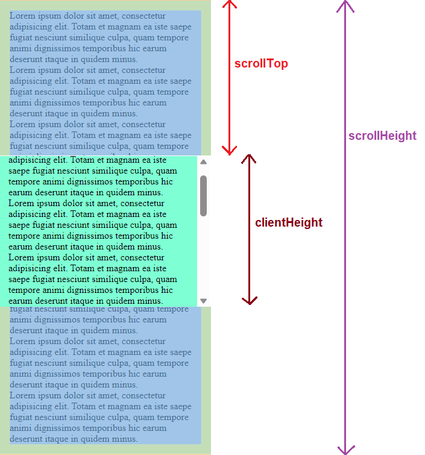
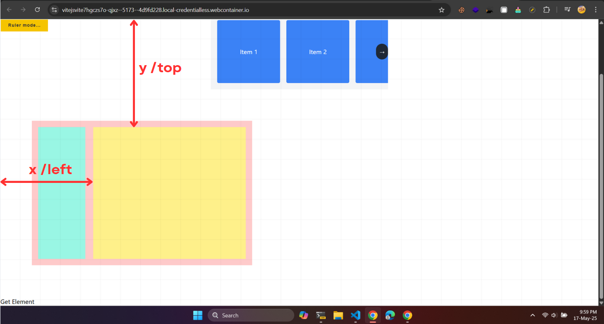

# HTML Elements

- Trong HTML, mỗi một **thẻ** trong HTML được gọi là một **Element** (phần tử).

## Thuộc tính, phương thức áp dụng cho tất cả Element

- **THUỘC TÍNH:**

| Attribute      | Description                                                                                                                                                    |
| -------------- | -------------------------------------------------------------------------------------------------------------------------------------------------------------- |
| `offsetWidth`  | Chiều dài của phần tử. Bao gồm phần content + padding + border + thanh scroll (nếu có)                                                                         |
| `offsetHeight` | Chiều cao của phần tử. Bao gồm phần content + padding + border + thanh scroll (nếu có)                                                                         |
| `clientWidth`  | Chiều dài phần tử. Nhưng chỉ bao gồm phần content + padding                                                                                                    |
| `clientHeight` | Chiểu cao của phần tử. Nhưng chỉ bao gồm phần content + padding                                                                                                |
| `scrollHeight` | Chiều cao thực tế của phần tử, bao gồm kích thước của nội dung vượt ra ngoài kích thước hiển thị của phần tử, bao gồm phần content + padding                   |
| `scrollWidth`  | Giống như scrollHeight nhưng là chiều dài của phần tử                                                                                                          |
| `scrollTop`    | Biểu thị lượng cuộn dọc hiện tại của phần tử. Giá trị của `scrollTop` bằng 0 khi phần tử không được cuộn, và tăng lên khi người dùng cuộn phần tử xuống dưới   |
| `scrollLeft`   | Tương tự như `scrollTop` nhưng là theo chiều ngang                                                                                                             |
| `offsetTop`    | Khoảng cách từ **đỉnh trên** của phần tử (top edge) đến **đỉnh trên** của phần tử cha gần nhất có thuộc tính position là `relative`, `absolute`, hoặc `fixed`  |
| `offsetLeft`   | Khoảng cách từ **cạnh trái** (left edge) của phần tử đến **cạnh trái** của phần tử cha gần nhất có thuộc tính position là `relative`, `absolute`, hoặc `fixed` |

:::caution

- Thuộc tính `transform (translateX, translateY, scale,...)` **KHÔNG** ảnh hưởng tới `offsetTop`, `offsetLeft`.
- Trong ví dụ dưới đây, ta thấy sau khi dùng `transform: translateX(-50%);`, mép trái phần tử con (box màu vàng) cách mép trái phần tử cha là **370px**, nhưng giá trị `offsetLeft` là: **400px** (tức là khoảng cách khi chưa có `transform`).

```jsx live
function MyComponent(props) {
  const ref = useRef(null);
  const [offsetLeft, setOffsetLeft] = useState(0);
  const [offsetTop, setOffsetTop] = useState(0);

  const handleGetOffsetLeft = () => {
    setOffsetTop(ref.current?.offsetTop);
    setOffsetLeft(ref.current?.offsetLeft);
  };

  return (
    <>
      <style
        dangerouslySetInnerHTML={{
          __html: `
            .container-xjplu {
              position: relative;
              width: 800px;
              height: 300px;
              background-color: red;
              padding: 10px;
            }

            .children-mjhdu {
              position: absolute;
              width: 60px;
              height: 60px;
              left: 50%;
              background-color: yellow;
              transform: translateX(-50%);
              top: -80px;
            }
          `,
        }}
      />
      <div className="container-xjplu">
        <div className="children-mjhdu" ref={ref}></div>
      </div>
      <button onClick={handleGetOffsetLeft}>Get offset</button>
      <p>Yellow box offset left: {offsetLeft}</p>
      <p>Yellow box offset top: {offsetTop}</p>
    </>
  );
}
```

:::



**PHƯƠNG THỨC:**

| Method                                              | Description                                                                                                                                                                                                                                                                                                                                                                                                                                                               |
| --------------------------------------------------- | ------------------------------------------------------------------------------------------------------------------------------------------------------------------------------------------------------------------------------------------------------------------------------------------------------------------------------------------------------------------------------------------------------------------------------------------------------------------------- |
| `click()`                                           | Thực hiện sự kiện giả lập**click** vào element                                                                                                                                                                                                                                                                                                                                                                                                                            |
| `focus()`                                           | Thực hiện sự kiện giả lập**focus** vào element                                                                                                                                                                                                                                                                                                                                                                                                                            |
| `blur()`                                            | Thực hiện sự kiện giả lập**blur** ra khỏi element                                                                                                                                                                                                                                                                                                                                                                                                                         |
| `scrollTo({ left: 0, top: 0, behavior: 'smooth' })` | Thực hiện sự kiện scroll lên trên hoặc sang trái tương ứng với số được chỉ định (áp dụng cho phần tử có thể cuộn được).                                                                                                                                                                                                                                                                                                                                                   |
| `getBoundingClientRect()`                           | Trả về 1 object chứa các thuộc tính sau:<br />`width`: Chiều rộng của phần tử<br />`height`: Chiều cao của phần tử<br />`x` / `left`: Khoảng cách từ mép trái của phần tử đến mép trái của viewport<br />`y` / `top`: Khoảng cách từ mép trên của phần tử đến mép trên của viewport. Giá trị âm khi đỉnh phần tử nằm bên trên viewport (tức khi người dùng cuộn trang xuống)<br />`right`: Là giá trị của `left` + `width`<br />`bottom`: Là giá trị của `top` + `height` |



## Thuộc tính áp dụng cho Input Element

| Property | Return value                                 |
| -------- | -------------------------------------------- |
| `value`  | Trả về giá trị hiện tại trong thẻ `<input/>` |

## Thuộc tính, phương thức áp dụng cho Audio/Video Element

- Các thuộc tính sau đây vừa trả về giá trị, vừa có thể dùng để thiết lập giá trị mới
  - **\<video/audioElement\>.property** : trả về giá trị
  - **\<video/audioElement\>.property = newValue** : thiết lập thuộc tính bằng giá trị mới

:::caution

Chú ý: thuộc tính mà trả về giá trị gì thì thiết lập cũng phải giống giá trị đó.

:::

| Property       | Return value                                                                                                                                                  |
| -------------- | ------------------------------------------------------------------------------------------------------------------------------------------------------------- |
| `currentTime`  | Trả về một**number** là thời gian hiện tại của audio/video (đơn vị giây)                                                                                      |
| `autoplay`     | Trả về `true` nếu audio/video tự động phát khi load                                                                                                           |
| `loop`         | Trả về `true` nếu audio/video tự lặp lại khi kết thúc                                                                                                         |
| `muted`        | Trả về `true` nếu audio/video không có âm lượng                                                                                                               |
| `playbackRate` | Trả về một**number** là tốc độ phát của video (giá trị mặc định ban đầu là 1)<br />- 0.5: Tốc độ chậm<br />- 1.0: Tốc độ bình thường<br />- 2.0: Tốc độ nhanh |
| `src`          | Trả về một**string** là URL của audio/video đang phát hiện tại                                                                                                |
| `controls`     | Trả về `true` nếu bảng điều khiến audio/video được hiển thị                                                                                                   |
| `volume`       | Trả về một**number** là giá trị volume của audio/video hiện tại (có giá trị từ 0.0 đến 1.0)                                                                   |

- Các thuộc tính sau đây chỉ trả về giá trị:

| Property   | Return value                                                                                    |
| ---------- | ----------------------------------------------------------------------------------------------- |
| `duration` | Trả về một**number** là độ dài của audio/video                                                  |
| `ended`    | Trả về `true` nếu video đã kết thúc                                                             |
| `paused`   | Trả về `true` nếu video đang bị tạm dừng                                                        |
| `seeking`  | Trả về `true` nếu audio/video được tua bởi người dùng, đi kèm với event `onseeked`, `onseeking` |

- Các phương thức:

| Method     | Description                                                                                                                              |
| ---------- | ---------------------------------------------------------------------------------------------------------------------------------------- |
| `load()`   | Re-load lại audio/video, thường dùng để phát audio/video mới sau khi thay đổi src của nó, hoặc phát lại video cũ khi không thay đổi src) |
| `play()`   | Phát audio/video                                                                                                                         |
| `paused()` | Tạm dừng audio/video                                                                                                                     |
