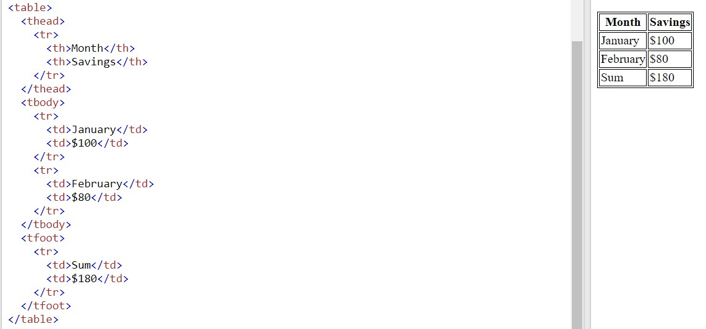

# Các thẻ liên quan đến table

- Thẻ `<table>` định nghĩa một bảng trong HTML
- Thẻ `<thead>` định nghĩa phần đầu trong bảng
- Thẻ `<tbody>` định nghĩa phần thân trong bảng
- Thẻ `<tfoot>` định nghĩa phần đuôi trong bảng
- Trong mỗi thẻ `<thead>` hoặc `<tbody>` hoặc `<tfoot>`, có những thẻ sau:
  - Thẻ `<tr>` định nghĩa một hàng trong table, nó có thể chứa nhiều thẻ `<td>`, `<th>`
  - Thẻ `<th>` xác định ô tiêu đề cho bảng, nó được in đậm và căn giữa theo mặc định (thường nằm trong thẻ `<thead>`
  - Thẻ `<td>` xác định nội dung dữ liệu trong bảng, được căn trái theo mặc định
- Ví dụ:

